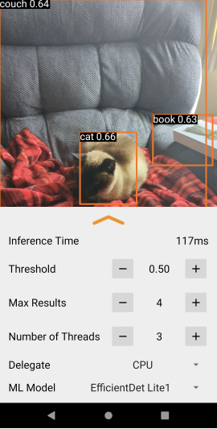

# V-E-SION: Advanced Object Detection System


## Overview

V-E-SION is a state-of-the-art object detection system that combines Convolutional Neural Networks (CNN) with U-Net architecture, powered by TensorFlow and trained on the COCO dataset. It provides real-time object detection, segmentation, and classification with high accuracy and performance.

[](https://www.python.org/downloads/)
[](https://tensorflow.org/)
[](LICENSE)
[](https://cocodataset.org/)

## 🌟 Key Features

- Real-time object detection with high accuracy
- Instance segmentation using U-Net architecture
- Support for 80+ object classes from COCO dataset
- GPU acceleration support
- Easy-to-use API for integration
- Batch processing capabilities
- Export to various formats (ONNX, TFLite, SavedModel)
- Visualization tools for detection results



## 🏗️ Architecture

V-E-SION uses a hybrid architecture combining:
- CNN backbone for feature extraction
- U-Net for precise segmentation
- Custom detection heads for object classification
- Feature Pyramid Network (FPN) for multi-scale detection

```
Input Image
    ↓
CNN Backbone 
    ↓
Feature Pyramid Network
    ↓
U-Net Segmentation
    ↓
Detection Heads
    ↓
Post-processing (NMS)
    ↓
Final Predictions
```

## 🛠️ Installation

### Prerequisites
- Python 3.8+
- CUDA 11.0+ (for GPU support)
- cuDNN 8.0+

### Setup

1. Clone the repository:
```bash
git clone https://github.comsachinchkd/v-e-sion.git

```
2. Download pre-trained weights:
```bash
python scripts/download_weights.py
```

